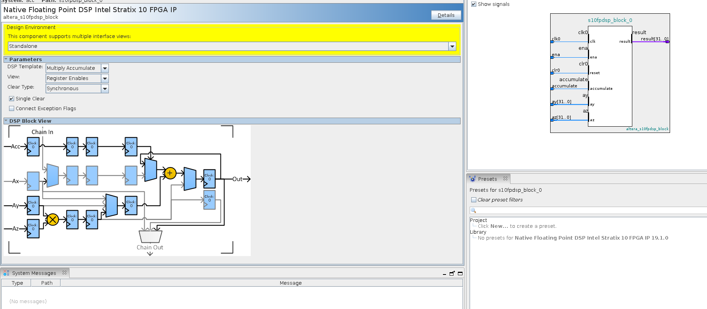
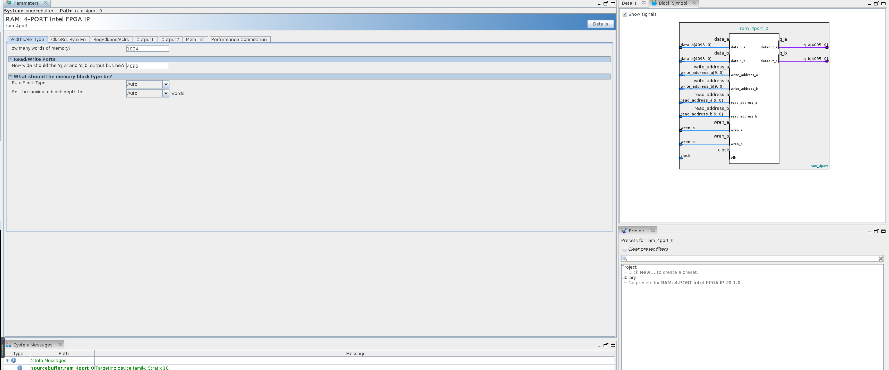
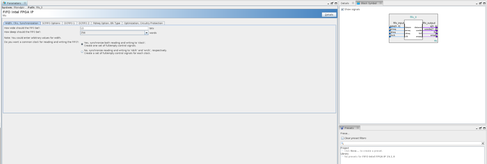
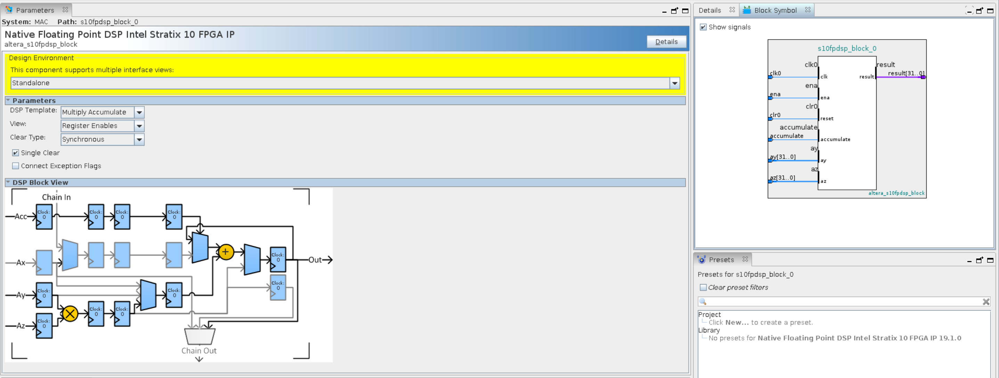

# GCN-ARCH
This is the architecture that appears in the paper:
- Bingyi Zhang, Hanqing Zeng and Viktor Prasanna, **Hardware Acceleration of Large Scale GCN Inference**, The 31st IEEE International Conference on
Application-specific Systems, Architectures and Processors. [[PDF](https://asap2020.cs.manchester.ac.uk/paper.php?id=38)]
- Zeng, Hanqing, and Viktor Prasanna. "**Graphact: Accelerating gcn training on cpu-fpga heterogeneous platforms.**" The 2020 ACM/SIGDA International Symposium on Field-Programmable Gate Arrays. 2020 [[PDF](https://dl.acm.org/doi/abs/10.1145/3373087.3375312?casa_token=8kcTIaTaLeEAAAAA:d4AqDlFmWVDwh4w2cfF_zXljwnWNEDNjdI4xRHscrYpde5MJR4uwmganQPqEq1kfDOpFGQb5BCaB)]

software: Quartus Prime Pro 20.2

### IP configuration
#### In feature aggregation module
- acc: selecting Native Floating Point DSP intel Stratrix 10 FPGA IP. The detailed configurations are:

  

- sourcebuffer: selecting RAM: 4-port intel FPGA IP. The detailed configurations are:

  

- fifoindpr: selecting FIFO Intel FPGA Ip. The detailed configurations are:

  

#### In feature aggregation module
- MAC: selecting Native Floating Point DSP intel Stratrix 10 FPGA IP. The detailed configurations are: 

  

